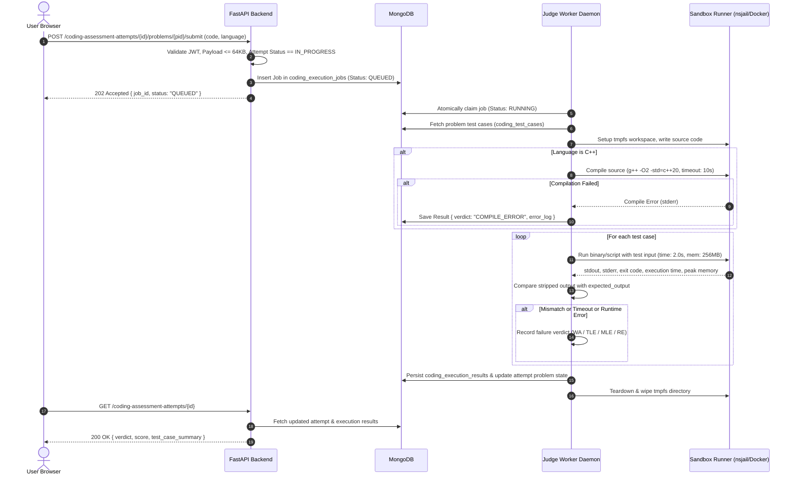

# PrepForge — Coding Judge & Sandbox Architecture Design

## 1. Executive Summary

### 1.1 Context & Purpose
PrepForge is a structured 12-week preparation platform designed for technical internship drives. In the **Timed Coding Assessment Foundation** milestone, user-submitted source code is securely collected and stored as passive, untrusted plain text (capped at 64 KB) with zero code execution.

This document designs the comprehensive architecture for a future **Secure Coding Judge & Execution Sandbox**. The goal of this engine is to safely compile, execute, and evaluate user-submitted Python and C++ code against deterministic test cases while upholding the following core project constraints:
1. **Self-Hostable & Free-First:** Operable on low-cost hardware (e.g., a $5–$10/month Linux VPS with 1–2 vCPUs and 2 GB RAM) without requiring expensive third-party SaaS judge APIs or heavyweight distributed clusters.
2. **Zero-Trust Security:** Treat all submitted code as inherently hostile, isolating host filesystems, environment secrets, and networks.
3. **Cross-Platform Developer Experience:** Seamless backend and frontend development on Windows workstations without risking host compromise.
4. **Architectural Simplicity:** Leverage existing MongoDB infrastructure for asynchronous job queues, avoiding unnecessary dependencies (e.g., Redis, Kafka, Celery) unless strictly needed.

---

## 2. Threat Model

User-submitted code must be classified as **untrusted, hostile bytecode/binaries**. Any execution environment that runs arbitrary user input is susceptible to severe security and infrastructure vulnerabilities.

```
       [Hostile User Code]
                │
    ┌───────────┴───────────┐
    ▼                       ▼
System Disruption     Data Exfiltration / Tampering
- Fork bombs          - Reading .env / JWT secrets
- Infinite loops      - Reading MongoDB credentials
- Memory exhaustion   - Port scanning local network
- Disk filling        - Reverse shells to internet
```

### 2.1 Specific Threat Analysis
1. **Arbitrary File Access:** Code attempts to read `/etc/passwd`, `.env`, MongoDB connection strings, JWT signing keys, or other users' attempts.
2. **Arbitrary Command Execution:** Code executes `system()`, `popen()`, `execve()`, or launches interactive shells (`/bin/bash`).
3. **Process Spawning & Fork Bombs:** Code executes `while(1) fork();` or `multiprocessing.Process` to exhaust host process table entries (PIDs).
4. **Infinite Loops & Excessive CPU:** Code executes `while true:` or intensive CPU loops, starving the host operating system and API server.
5. **Memory Exhaustion (OOM):** Code allocates gigabytes of RAM (e.g., `[0] * 10**9`), triggering the Linux Out-Of-Memory killer against the MongoDB database or API server.
6. **Disk Exhaustion:** Code writes infinite streams to temporary files or stdout/stderr (e.g., gigabyte-sized log dumps).
7. **Network Access & SSRF:** Code establishes outbound sockets to connect to remote botnets, command-and-control servers, crypto mining pools, or internal cloud metadata services (`http://169.254.169.254`).
8. **Environment Variable Exposure:** Code inspects `os.environ` or `getenv()` to dump server environment variables.
9. **Compiler Abuse (C++):** C++ code exploits preprocessor bombs, massive template recursion, or `#include </dev/urandom>` to freeze the compiler.
10. **Malicious Imports (Python):** Scripts import `ctypes`, `socket`, `subprocess`, `pty`, or manipulate internal memory to bypass high-level Python restrictions.
11. **Container Escape:** Exploitation of kernel vulnerabilities or improperly configured container privileges (`--privileged`, mounted Docker socket) to gain root access to the host.
12. **Denial of Service via Queue Flooding:** Submitting hundreds of slow jobs simultaneously to lock up judge worker threads.

### 2.2 Threat Classification Matrix

| Threat | Status | Primary Enforcement Mechanism |
| :--- | :--- | :--- |
| **Arbitrary File Access** | **PREVENTED** | Read-only root filesystem (`--read-only`), ephemeral unprivileged `tmpfs` mounts, stripped mount namespaces. |
| **Arbitrary Command Execution** | **PREVENTED** | Execution confined inside non-root container (`UID 10001`), no setuid binaries, dropped Linux capabilities (`CAP_DROP_ALL`). |
| **Process / Fork Bombs** | **PREVENTED** | Linux cgroups PID limit (`pids.max = 16` / Docker `--pids-limit 16`). |
| **Infinite Loops** | **PREVENTED** | Hard OS execution timeouts (`SIGKILL` after 2.0s per test case; wall-clock supervisor watchdog). |
| **Excessive CPU Hogging** | **PREVENTED** | cgroups CPU quota (`cpu.max = 100000 100000` -> 1 CPU core allocation). |
| **Memory Exhaustion (OOM)** | **PREVENTED** | cgroups Memory limit (`memory.max = 256MB` / Docker `-m 256m`). |
| **Disk Exhaustion** | **PREVENTED** | In-memory RAM disk `tmpfs` capped at 16 MB; stdout/stderr capture buffer truncated at 1 MB. |
| **Network Access / SSRF** | **PREVENTED** | Network namespace disabled (`--network none` / `CLONE_NEWNET`). Zero inbound/outbound connectivity. |
| **Environment Secret Leakage** | **PREVENTED** | Sandbox executed with clean, empty environment (`env -i`); zero host `.env` variables passed to container. |
| **Compiler Preprocessor Bombs** | **MITIGATED** | Compiler process executed with strict timeout (10.0s) and 512MB RAM cap inside container. |
| **Malicious Language Imports** | **MITIGATED** | Handled at OS layer (kernel cgroups + seccomp) rather than brittle application-level AST blocklists. |
| **Queue Starvation / DoS** | **MITIGATED** | Max 1 active in-progress attempt per user, rate-limited submissions, bounded worker pool. |
| **Kernel 0-Day Container Escape** | **RESIDUAL RISK** | Mitigated by non-root execution, seccomp filters, and unprivileged user namespaces. |
| **Hardware Performance Counters**| **OUT OF SCOPE**| Micro-architectural cycle counting or cache-miss profiling is outside MVP requirements. |

---

## 3. Execution Architecture Options

We evaluate four architectural approaches for PrepForge's coding judge.

```
Option A: Direct Subprocess (FastAPI Host)
[ FastAPI Backend ] ───(subprocess.run)───> [ Host OS ] (UNSAFE)

Option B: Docker-in-Docker / Local Container per Run
[ FastAPI Backend ] ───(docker run)───> [ Ephemeral Docker Sandbox ]

Option C: Dedicated Worker + Message Queue (Celery/Redis)
[ FastAPI ] ───> [ Redis ] ───> [ Celery Worker ] ───> [ Sandbox ]

Option D (Recommended): Decoupled Polling Judge Worker (MongoDB Job Queue)
[ FastAPI Backend ] ───(Job Insert)───> [ MongoDB Queue ] <───(Poll/Claim)─── [ Judge Worker ] ───> [ Sandbox ]
```

### 3.1 Architectural Trade-Off Analysis

| Criteria | Option A: Direct Subprocess on Host | Option B: Ephemeral Docker in FastAPI | Option C: Dedicated Worker (Redis/Celery) | Option D: Decoupled Worker (MongoDB Queue) |
| :--- | :--- | :--- | :--- | :--- |
| **Isolation Level** | **Zero / Dangerous** (Host compromise) | High (Container boundaries) | High (Container + Service isolation) | **High (Container + Service isolation)** |
| **Security Risk** | Critical | Low | Low | **Low** |
| **Implementation Complexity** | Low | Medium | High | **Medium-Low** |
| **Windows Dev Compatibility** | Risky / Problematic | Requires Docker Desktop | High (multiple services) | **Excellent (Mock on Win / Docker on Linux)** |
| **Linux Deployment Compatibility**| Poor | Good | Good | **Excellent (Single Docker Compose)** |
| **Resource Limiting** | Weak / Inconsistent on Windows | Strong (cgroups) | Strong (cgroups) | **Strong (cgroups)** |
| **Infrastructure Overhead** | None | Low | High (Redis + Celery daemons) | **Minimal (Uses existing MongoDB)** |
| **Host Resource Usage ($5 VPS)** | Low | Low-Medium | High (RAM pressure) | **Low (Lean Python worker daemon)** |
| **Suitability for PrepForge** | **REJECTED** | Feasible | Over-engineered | **RECOMMENDED** |

### 3.2 Decision & Rationale
- **Option A is REJECTED:** Direct host subprocess execution on the FastAPI host exposes the entire application, database credentials, and host server to trivial compromise.
- **Option C is REJECTED for MVP:** Introducing Redis, Celery, or RabbitMQ adds memory and operational overhead that violates PrepForge's single-node, free-first deployment goals.
- **Option D is SELECTED:** A decoupled Python Judge Worker that polls MongoDB for queued jobs provides:
  1. Complete decoupling between the web API and untrusted code execution.
  2. Crash resilience (a worker crash never brings down FastAPI or the user session).
  3. Zero new infrastructure dependencies (leverages existing MongoDB database for durable job state).
  4. Pluggable sandbox backend: uses disposable Docker/Podman containers or `nsjail` on Linux, while falling back to a safe mock runner during local Windows development.

---

## 4. Recommended Architecture

### 4.1 System Topology Diagram

```mermaid
flowchart TD
    subgraph ClientLayer ["Client Layer (Untrusted)"]
        Browser["User Browser (React UI)"]
    end

    subgraph APILayer ["Web & API Layer (Trusted DMZ)"]
        FastAPI["FastAPI Backend Server"]
        AuthDep["JWT Auth & Request Validator"]
    end

    subgraph DataLayer ["Persistence Layer (Trusted)"]
        MongoDB[("MongoDB Database\n- coding_problems\n- coding_test_cases\n- coding_execution_jobs\n- coding_execution_results")]
    end

    subgraph WorkerLayer ["Judge Dispatcher Layer (Trusted)"]
        JudgeWorker["PrepForge Judge Worker Daemon\n(Atomic Job Claimer & Test Case Fetcher)"]
    end

    subgraph SandboxLayer ["Isolated Sandbox Layer (Zero-Trust)"]
        Runner["Container / nsjail Sandbox Runner\n- UID: 10001 (nobody)\n- Network: NONE\n- Rootfs: Read-Only\n- Tmpfs: 16MB RAM\n- CPU Quota: 1.0 core\n- Memory: 256MB"]
        Compiler["C++ GCC Compiler\n(10s / 512MB limit)"]
        Executor["Execution Engine\n(Python 3.12 / C++ Binary)"]
    end

    Browser -->|1. Submit Code| FastAPI
    FastAPI --> AuthDep
    AuthDep -->|2. Validate & Enqueue Job| MongoDB
    FastAPI -->|3. Return Job ID / QUEUED| Browser

    JudgeWorker -->|4. Poll & Claim Job (find_and_modify)| MongoDB
    JudgeWorker -->|5. Fetch Test Cases| MongoDB
    JudgeWorker -->|6. Provision Sandbox Workspace| Runner

    Runner -->|7a. Compile if C++| Compiler
    Runner -->|7b. Run against Test Cases| Executor

    Executor -->|8. Capture Output & Exit Codes| JudgeWorker
    JudgeWorker -->|9. Grade & Compare Outputs| JudgeWorker
    JudgeWorker -->|10. Persist Final Result| MongoDB

    Browser -->|11. Poll / Fetch Result| FastAPI
    FastAPI -->|12. Return Authoritative Result| Browser
```

---

## 5. Execution Flow & Lifecycle

The lifecycle of a code submission follows a deterministic 10-step pipeline:



---

## 6. Language Strategy

```
  ┌───────────────────────────────────────────────────────────┐
  │                    LANGUAGE STRATEGY                      │
  ├─────────────────────────────┬─────────────────────────────┤
  │       Python 3.12+          │        C++ 20 (GCC)         │
  ├─────────────────────────────┼─────────────────────────────┤
  │ - Clean CPython Interpreter │ - g++ 13+ Compiler          │
  │ - Unbuffered mode (-u)      │ - Flags: -O2 -std=c++20     │
  │ - Bytecode disabled (-B)    │ - Static linking (-static)  │
  │ - Isolated stdlib only      │ - Disallow asm (-fno-asm)   │
  │ - OS-level containment     │ - Strict 10s compile limit  │
  └─────────────────────────────┴─────────────────────────────┘
```

### 6.1 Python Strategy
- **Interpreter:** Standard CPython 3.12 (standard minimal base image).
- **Execution Command:**
  ```bash
  python3 -B -u solution.py < input.txt > output.txt
  ```
- **Flags:**
  - `-B`: Prevents `.pyc` bytecode files from being written to disk.
  - `-u`: Forces unbuffered binary stdout and stderr streams for accurate real-time output capture.
- **Security Rule:** **Never rely on Python AST filtering or module monkeypatching.** Attackers routinely bypass AST blocklists via `__builtins__`, `eval()`, string interpolation, or C-extensions. Full isolation is strictly delegated to the OS container layer.

### 6.2 C++ Strategy
- **Compiler:** GCC 13+ (`g++`).
- **Compilation Command:**
  ```bash
  g++ -O2 -std=c++20 -static -fno-asm -Wall solution.cpp -o solution.bin
  ```
- **Flags:**
  - `-O2`: Standard optimization level matching competitive programming standards.
  - `-std=c++20`: Modern language features and standard template library (STL).
  - `-static`: Eliminates dynamic linking dependencies inside the execution sandbox.
  - `-fno-asm`: Disables inline assembly instructions (`__asm__`).
- **Compilation Constraints:**
  - Time limit: 10.0 seconds.
  - Memory limit: 512 MB.
  - Compiler error messages sanitized and truncated at 4 KB before returning to the user.

---

## 7. Resource Limits & Enforcement Matrix

Security limits must be applied at multiple defense layers:

```
[Layer 1: Application (FastAPI)] ──> Max 64 KB source payload
[Layer 2: Compiler Sandbox]      ──> Max 10.0s time, 512 MB RAM
[Layer 3: Execution Sandbox]     ──> Max 2.0s CPU, 256 MB RAM, 16 PIDs, 16 MB tmpfs, 0 Net
[Layer 4: Output Collector]      ──> Max 1 MB stdout capture
```

### 7.1 Detailed Resource Bounds

| Parameter | Limit | Enforcement Layer | Action on Violation |
| :--- | :--- | :--- | :--- |
| **Source Code Size** | 64 KB | FastAPI Pydantic validator | HTTP 422 / 400 Bad Request |
| **Compilation Timeout** | 10.0s | Worker timeout / Subprocess timer | Return `COMPILE_ERROR` ("Compilation Timed Out") |
| **Compilation Memory** | 512 MB | Container cgroups (`memory.max`) | Return `COMPILE_ERROR` ("Compiler Out of Memory") |
| **Execution Time (CPU)** | 2.0s (default) | Linux cgroups / `setrlimit(RLIMIT_CPU)` | Return `TIME_LIMIT_EXCEEDED` (`TLE`) |
| **Execution Wall Clock** | 3.0s | Worker supervisor process (`SIGKILL`) | Return `TIME_LIMIT_EXCEEDED` (`TLE`) |
| **Execution Memory** | 256 MB | Linux cgroups (`memory.max` / `-m 256m`) | Return `MEMORY_LIMIT_EXCEEDED` (`MLE`) |
| **Max Process Count** | 16 PIDs | Linux cgroups (`pids.max = 16`) | Fork blocked (`EAGAIN` / `RUNTIME_ERROR`) |
| **Temporary Disk Space** | 16 MB | `tmpfs` RAM disk mount size limit | Disk write fails (`ENOSPC` / `RUNTIME_ERROR`) |
| **Output Size** | 1 MB | Stream reader buffer limit | Truncate output + `OUTPUT_LIMIT_EXCEEDED` / `WA` |
| **Max Concurrent Jobs** | 2 per CPU core | Judge Worker job concurrency semaphore | Job remains `QUEUED` in MongoDB |

---

## 8. Network Security Policy

```
┌─────────────────────────────────────────────────────────────┐
│                    NETWORK ISOLATION                        │
│                                                             │
│   Host Server                Sandbox Container              │
│  ┌───────────┐              ┌───────────────────────────┐   │
│  │ FastAPI   │              │   Hostile User Code       │   │
│  │ MongoDB   │      X       │                           │   │
│  │ Internet  │ ───────────► │   --network none          │   │
│  │ LAN / DNS │              │   No eth0, No loopback,   │   │
│  │ Metadata  │              │   No Sockets Permitted    │   │
│  └───────────┘              └───────────────────────────┘   │
└─────────────────────────────────────────────────────────────┘
```

1. **Zero Network Interfaces:** Sandboxes are provisioned with `--network none` (Docker) or unshared network namespace (`CLONE_NEWNET` via `nsjail`).
2. **Blocked Targets:**
   - Public Internet: Zero outbound requests (no HTTP, DNS, raw TCP/UDP).
   - Localhost / Loopback: Cannot connect to FastAPI (`127.0.0.1:8000`) or MongoDB (`127.0.0.1:27017`).
   - Private LAN: Cannot probe other servers on the host private subnet (`10.0.0.0/8`, `192.168.0.0/16`).
   - Cloud Metadata: Cannot reach `169.254.169.254` to steal instance credentials.
3. **Rationale:** Complete network deprivation neutralizes all data exfiltration, SSRF, reverse shells, and network botnet attacks at the Linux kernel level.

---

## 9. Filesystem Security & Workspace Isolation

```
[Host Filesystem] (Completely Inaccessible)
   ├── /app/
   ├── /etc/
   └── .env (PROTECTED)

[Sandbox Rootfs] (Read-Only)
   ├── /bin/
   ├── /lib/
   └── /usr/

[Sandbox Workspace] (tmpfs in RAM, 16 MB, Unprivileged, Wiped after run)
   ├── solution.cpp / solution.py
   ├── input.txt
   └── output.txt
```

1. **Read-Only Root Filesystem:** System binaries and libraries inside the container image are mounted strictly as read-only (`--read-only`).
2. **RAM-backed `tmpfs` Workspace:** Each test run receives an isolated `/sandbox` directory mounted as a temporary RAM disk (`tmpfs`) with a 16 MB limit and `noexec` on subpaths where applicable.
3. **Clean Environment Isolation:** The execution command runs under an empty environment (`env -i`) so that host secrets (`MONGODB_URL`, `JWT_SECRET`) are never inherited.
4. **Non-Root Execution:** Executed under dedicated unmapped system user `nobody` (`UID 10001`, `GID 10001`).
5. **Deterministic Cleanup:** After execution (or upon unexpected crash/timeout), the worker's `finally` block unmounts and deletes the workspace directory.

---

## 10. Test Case Model & Storage Strategy

### 10.1 Schema: `coding_test_cases`
```json
{
  "_id": "ObjectId",
  "id": "tc-two-sum-01",
  "problem_id": "two-sum-sorted",
  "order": 1,
  "input": "4\n2 7 11 15\n9\n",
  "expected_output": "1 2",
  "is_hidden": false,
  "time_limit_ms": 2000,
  "memory_limit_mb": 256,
  "created_at": "2026-09-23T12:00:00Z"
}
```

### 10.2 Public vs. Hidden Test Cases
- **Public Sample Cases (`is_hidden: false`):**
  - Match the examples in the problem description.
  - When evaluated, full input, user output, and expected output are visible to the user for debugging.
- **Hidden Assessment Cases (`is_hidden: true`):**
  - Test boundary conditions (empty lists, max constraints, negative values, duplicates).
  - When evaluated, only the verdict (`Passed` / `Failed`) and execution time/memory are returned.
  - **Security Invariant:** API endpoints strictly censor `input` and `expected_output` for hidden test cases.

### 10.3 Storage Location
- Test cases are stored in the MongoDB `coding_test_cases` collection.
- Seeded idempotently during backend startup from declarative seed definitions.
- Keeps test-case management consistent with PrepForge's static curriculum seed architecture.

---

## 11. Result Model & Status Codes

### 11.1 Authoritative Verdict Enum
- `QUEUED`: Job is waiting in queue for an available worker.
- `RUNNING`: Job is currently executing inside the sandbox.
- `ACCEPTED` (`AC`): All test cases passed with identical outputs within time/memory limits.
- `WRONG_ANSWER` (`WA`): Output differed from expected output on one or more test cases.
- `TIME_LIMIT_EXCEEDED` (`TLE`): CPU or wall-clock limit exceeded.
- `MEMORY_LIMIT_EXCEEDED` (`MLE`): RAM limit exceeded.
- `COMPILE_ERROR` (`CE`): C++ source code failed compilation.
- `RUNTIME_ERROR` (`RE`): Script crashed (uncaught exception, segfault, zero division).
- `SYSTEM_ERROR` (`SE`): Internal infrastructure failure (sandbox failed to launch).

### 11.2 Result Record Schema (`coding_execution_results`)
```json
{
  "id": "res-uuid-1234",
  "job_id": "job-uuid-5678",
  "attempt_id": "att-uuid-9012",
  "problem_id": "two-sum-sorted",
  "user_id": "user-uuid-3456",
  "verdict": "ACCEPTED",
  "passed_test_cases": 5,
  "total_test_cases": 5,
  "score_awarded": 10,
  "execution_time_ms": 42,
  "peak_memory_mb": 18.4,
  "compiler_output": "",
  "test_case_results": [
    {
      "test_case_id": "tc-two-sum-01",
      "order": 1,
      "is_hidden": false,
      "verdict": "ACCEPTED",
      "time_ms": 12,
      "memory_mb": 14.2,
      "user_output": "1 2",
      "expected_output": "1 2"
    },
    {
      "test_case_id": "tc-two-sum-02",
      "order": 2,
      "is_hidden": true,
      "verdict": "ACCEPTED",
      "time_ms": 30,
      "memory_mb": 18.4,
      "user_output": null,
      "expected_output": null
    }
  ],
  "created_at": "2026-09-23T12:05:00Z"
}
```

---

## 12. Assessment Scoring & Grading Model

### 12.1 Problem-Level Scoring
For a problem with maximum marks $M$ and $T$ total test cases, where $P$ test cases pass:

$$\text{Problem Score} = \text{round}\left( \frac{P}{T} \times M \right)$$

- **Full Credit:** All test cases pass ($P = T \implies \text{Score} = M$, `verdict = ACCEPTED`).
- **Partial Credit:** Subset of test cases pass ($0 < P < T \implies \text{Score} = \text{round}(\frac{P}{T} \times M)$, `verdict = WRONG_ANSWER`).
- **Zero Credit:** `COMPILE_ERROR`, zero test cases passed, or problem unsubmitted ($\text{Score} = 0$).

### 12.2 Assessment-Level Aggregation
For an assessment containing problems $p_1, p_2, \dots, p_k$:

$$\text{Total Score} = \sum_{i=1}^k \text{Score}(p_i)$$

$$\text{Total Marks} = \sum_{i=1}^k \text{Marks}(p_i)$$

$$\text{Percentage} = \left( \frac{\text{Total Score}}{\text{Total Marks}} \right) \times 100$$

$$\text{Passed} = \text{Percentage} \ge \text{Passing Score}$$

Unanswered problems default to 0 marks and `NOT_SUBMITTED`.

---

## 13. Asynchronous Execution Strategy

```
[FastAPI Backend] ──(1. Insert Job)──> [MongoDB: coding_execution_jobs]
                                               │
                                               │ (2. Atomic Claim: find_and_modify)
                                               ▼
                                      [Judge Worker Daemon]
                                               │
                                               │ (3. Execute in Sandbox)
                                               ▼
[FastAPI Polling] <──(4. Update Doc)── [MongoDB: coding_execution_results]
```

### 13.1 Why MongoDB Queue over Redis/Celery?
1. **Zero Extra Daemon Overhead:** PrepForge already runs MongoDB. Running a separate Redis instance plus Celery workers consumes 200–400 MB of extra RAM on constrained VPS hosts.
2. **Atomic Job Claiming:** MongoDB's `find_one_and_update` provides atomic, race-free job claiming across multiple workers:
   ```python
   job = await db["coding_execution_jobs"].find_one_and_update(
       {"status": "QUEUED"},
       {"$set": {"status": "RUNNING", "claimed_at": datetime.now(timezone.utc)}},
       sort=[("created_at", 1)]
   )
   ```
3. **Crash Recovery & Stale Lock Reclamation:** If a worker crashes while processing a job, any job in `RUNNING` status whose `claimed_at` timestamp is older than 5 minutes is automatically reset to `QUEUED`.

---

## 14. Failure Handling & Resilience

| Scenario | Classification | System Behavior | User Impact |
| :--- | :--- | :--- | :--- |
| **Compilation Error** | User Error | Worker captures stderr, marks job `COMPLETED`, verdict `COMPILE_ERROR`. | User receives compiler message to fix code. |
| **Infinite Loop / Timeout** | User Error | Worker sends `SIGKILL` at 2.0s, marks test case `TIME_LIMIT_EXCEEDED`. | Problem scored 0 for that test case. |
| **Memory Crash (OOM)** | User Error | cgroups kills process, worker detects OOM exit code, marks `MEMORY_LIMIT_EXCEEDED`. | Problem scored 0 for that test case. |
| **Runtime Exception / Crash** | User Error | Script exits with non-zero code, worker captures stack trace, marks `RUNTIME_ERROR`. | User sees error summary. |
| **Sandbox Engine Crash** | System Error | Worker catches infrastructure exception, retries up to 2 times. If still failing, marks `SYSTEM_ERROR`. | User is not penalized; can re-trigger run. |
| **Worker Process Killed** | System Error | Stale job reaper resets `RUNNING` job to `QUEUED` after 5 minutes. | Job picked up by restarted worker. |
| **Network Interruption** | System Error | Client retries polling with exponential backoff. | Result displayed when connection restored. |

---

## 15. Security Boundaries & Trust Zones

```
┌──────────────────────────────────────────────────────────────────┐
│ TRUST ZONE 0: Untrusted External Zone (User Browser / Client)     │
│ - Raw code input, untrusted HTTP payloads                        │
└─────────────────────────────────┬────────────────────────────────┘
                                  │ HTTP / TLS (JWT Bearer)
┌─────────────────────────────────▼────────────────────────────────┐
│ TRUST ZONE 1: Trusted Web DMZ (FastAPI Application)              │
│ - JWT Authentication, Pydantic 64KB Validator, Route Handler    │
└─────────────────────────────────┬────────────────────────────────┘
                                  │ Internal Network
┌─────────────────────────────────▼────────────────────────────────┐
│ TRUST ZONE 2: Trusted Data Core (MongoDB Database)               │
│ - Curated Questions, Test Cases, Job Queue, Execution Results    │
└─────────────────────────────────┬────────────────────────────────┘
                                  │ Atomic Poll / Claim
┌─────────────────────────────────▼────────────────────────────────┐
│ TRUST ZONE 3: Trusted Dispatcher (Judge Worker Daemon)           │
│ - Job Scheduler, Test Input Feeder, Output Comparator            │
└─────────────────────────────────┬────────────────────────────────┘
                                  │ Linux cgroups / nsjail boundary
┌─────────────────────────────────▼────────────────────────────────┐
│ TRUST ZONE 4: Zero-Trust Hostile Sandbox (Unprivileged Runner)    │
│ - UID 10001 (nobody), --network none, Read-Only Root, 16MB Tmpfs │
│ - Hostile Python / C++ Program Execution                         │
└──────────────────────────────────────────────────────────────────┘
```

---

## 16. Windows Development Strategy

A developer working on PrepForge on Windows must **never** execute untrusted user submissions directly on their host OS.

```
                    DEVELOPER WORKFLOW ON WINDOWS
                                │
        ┌───────────────────────┴───────────────────────┐
        ▼                                               ▼
Mode A: Mock Engine (Default)             Mode B: Docker Desktop (Optional)
- Windows host development                - Full sandbox integration testing
- Judge Worker returns mock results       - Worker runs inside Linux container
- Zero subprocesses spawned on host       - Real cgroups/nsjail inside WSL2
- 100% safe for standard UI/API work      - Used for end-to-end sandbox tests
```

1. **Mode A — Default Mock Judge (Fast & Safe):**
   - In development mode (`ENVIRONMENT=development`), the Judge Worker uses a `MockExecutionEngine`.
   - Returns deterministic simulated execution results (e.g. `ACCEPTED` after a 500ms delay) without compiling or executing user code on Windows.
   - Allows full UI, dashboard, attempt history, and API development with zero host risk.
2. **Mode B — WSL2 / Docker Engine (Sandbox Testing):**
   - When integration testing of the actual compiler/sandbox is required on Windows, development runs entirely inside Docker Desktop backed by the WSL2 Linux kernel.

---

## 17. Linux Deployment Strategy (Self-Hostable)

### 17.1 Docker Compose Deployment Model
For a self-hosted Linux VPS ($5–$10/month, 1–2 vCPUs, 2 GB RAM):

```yaml
version: '3.8'

services:
  prepforge-backend:
    build: ./backend
    restart: always
    environment:
      - ENVIRONMENT=production
      - MONGODB_URL=mongodb://mongo:27017/prepforge
    depends_on:
      - mongo

  prepforge-judge-worker:
    build:
      context: ./judge-worker
      dockerfile: Dockerfile
    restart: always
    environment:
      - MONGODB_URL=mongodb://mongo:27017/prepforge
      - MAX_CONCURRENT_JOBS=2
    privileged: false
    security_opt:
      - no-new-privileges:true
    depends_on:
      - mongo

  mongo:
    image: mongo:7.0
    restart: always
    volumes:
      - mongo_data:/data/db

  prepforge-frontend:
    build: ./frontend
    restart: always
    ports:
      - "80:80"
    depends_on:
      - prepforge-backend

volumes:
  mongo_data:
```

### 17.2 Unsuitable Environments
- **Unsuitable:** Shared cPanel web hosting, serverless edge functions (Vercel/Netlify for backend execution), Windows Server hosts without WSL2/Docker isolation.
- **Suitable:** Linux VPS (Ubuntu 22.04/24.04, Debian 12), Dedicated Linux instances, Docker Compose environments.

---

## 18. Future Database Schema & Data Models

The future sandbox integration will introduce 4 new collections that seamlessly connect with the existing foundation:

```
Existing Foundation:
[coding_assessments] ──< [coding_problems]
         │
         ▼
[coding_assessment_attempts] ──> problem_states

Future Judge Integration:
[coding_problems] ──< [coding_test_cases]
                            │
[coding_assessment_attempts] ──> [coding_execution_jobs] ──> [coding_execution_results]
```

### 18.1 Collection Overview

1. `coding_test_cases`:
   - Parent: `coding_problems`
   - Fields: `id`, `problem_id`, `order`, `input`, `expected_output`, `is_hidden`, `time_limit_ms`, `memory_limit_mb`.
2. `coding_execution_jobs`:
   - Parent: `coding_assessment_attempts`
   - Fields: `id`, `attempt_id`, `problem_id`, `user_id`, `code`, `language`, `status` (`QUEUED`, `RUNNING`, `COMPLETED`, `FAILED`), `created_at`, `claimed_at`, `completed_at`.
3. `coding_execution_results`:
   - Parent: `coding_execution_jobs`
   - Fields: `id`, `job_id`, `attempt_id`, `problem_id`, `user_id`, `verdict`, `passed_test_cases`, `total_test_cases`, `score_awarded`, `execution_time_ms`, `peak_memory_mb`, `compiler_output`, `test_case_results`, `created_at`.
4. `coding_assessment_attempts` (Existing):
   - Updated upon job completion to store authoritative `score`, `percentage`, `passed`, and problem-level verdicts.

---

## 19. Weakness Integration Workflow

The future judge integrates with the existing Weakness Manager following the established **explicit user-confirmation principle**:

```
[Judge Completes Evaluation]
             │
             ▼
[Attempt Review Screen Displays Failed Problems]
(e.g., Problem 2: Longest Substring — WRONG_ANSWER)
             │
             ▼
[User Clicks "Add to Weaknesses" Button]
             │
             ▼
[Modal: Select Priority (HIGH/MED/LOW) & Review Date]
             │
             ▼
[POST /api/v1/weaknesses]
- source_type: "CODING_ASSESSMENT"
- topic: "Sliding Window"
- title: "Longest Substring with At Most K Distinct Characters"
             │
             ▼
[Weakness Tracked in Weakness Manager & Weekly Review]
```

**Key Invariant:** Zero automated weakness records are created without explicit user action. This prevents spamming the user's weakness board when exploring experimental code attempts.

---

## 20. Explicit Non-Goals (Out of Scope for MVP)

To maintain focus and avoid over-engineering, the following capabilities are explicitly **excluded** from the MVP sandbox design:
1. **No Interactive / Graphical Execution:** No support for GUI libraries (`tkinter`, `pygame`), interactive terminal input loops (beyond pre-fed stdin), or web servers.
2. **No Multi-File Projects / Build Systems:** No support for multi-file C++ projects, CMake, Makefiles, or arbitrary package installations (`pip install`, `vcpkg`).
3. **No GPU Acceleration:** No CUDA or GPU runtime support.
4. **No Complex Multi-Cloud Orchestration:** No Kubernetes or distributed worker meshes; a single-node Linux worker daemon is the target.
5. **No Live Debugging REPL:** No interactive `gdb` or `pdb` step-through sessions.
6. **No AI Code Autogeneration:** The sandbox evaluates deterministic human code against deterministic test cases without generative AI in the execution loop.

---

## 21. Summary & Roadmap

| Phase | Status | Milestone Focus |
| :--- | :--- | :--- |
| **Phase 1** | **COMPLETED** | Timed Coding Assessment Foundation (Schemas, 10 Problems, 2 Week 11 Assessments, No-Execution Plaintext Storage, 83 Tests Passing). |
| **Phase 2** | **COMPLETED (Current)** | Coding Judge & Sandbox Architecture Design (`docs/coding-judge-architecture.md`). |
| **Phase 3** | **FUTURE** | Sandbox Implementation (Decoupled Worker, Linux nsjail/Docker runner, Test Case Engine, Scoring Evaluation). |
| **Phase 4** | **FUTURE** | Mock Interview Simulation Engine & Final Drive Integration. |
