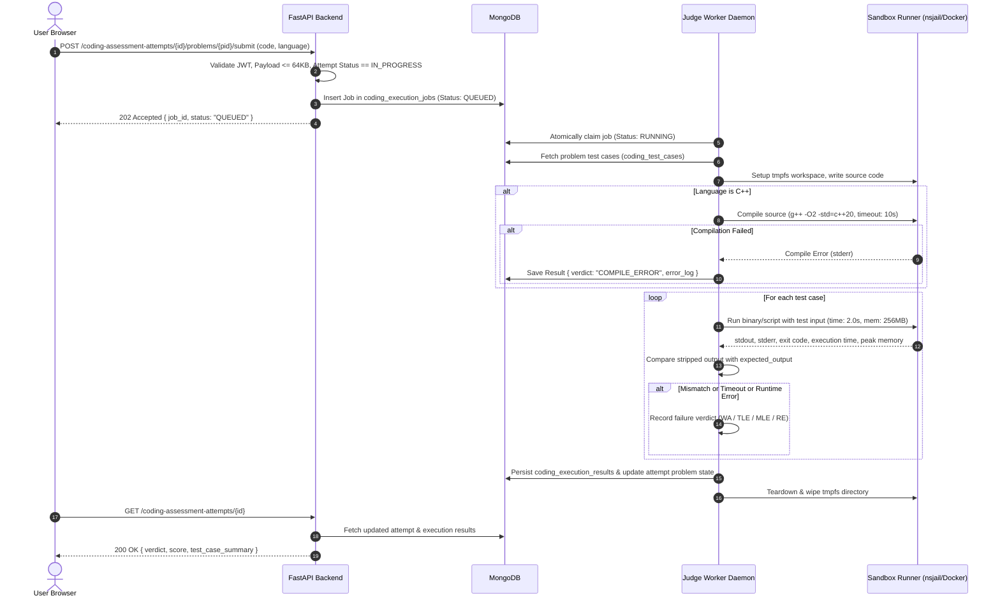

# PrepForge — Coding Judge & Sandbox Architecture Design

## 1. Executive Summary

### 1.1 Context & Purpose
PrepForge is a personal, structured 12-week preparation platform designed for technical internship drives. In the **Timed Coding Assessment Foundation** milestone, user-submitted source code is securely collected and stored as passive, untrusted plain text (capped at 64 KB) with zero code execution.

This document designs the comprehensive architecture for a future **Secure Coding Judge & Execution Sandbox**. The goal of this engine is to safely compile, execute, and evaluate user-submitted Python and C++ code against deterministic test cases while upholding the following core project constraints:
1. **Self-Hostable & Free-First:** Operable on low-cost hardware (e.g., a $5–$10/month Linux VPS with 1–2 vCPUs and 2 GB RAM) without requiring expensive third-party SaaS judge APIs or heavyweight distributed clusters.
2. **Zero-Trust Security:** Treat all submitted code as inherently hostile, isolating host filesystems, environment secrets, and networks.
3. **Cross-Platform Developer Experience:** Seamless backend and frontend development on Windows workstations without risking host compromise.
4. **Architectural Simplicity:** Leverage existing MongoDB infrastructure for asynchronous job queues, avoiding unnecessary dependencies (e.g., Redis, Kafka, Celery) unless strictly needed.

---

## 2. Current System Context

PrepForge is currently comprised of:
- **Frontend:** React 18 SPA built with Vite, utilizing vanilla CSS/inline design systems for clean, minimal footprint.
- **Backend:** FastAPI (Python 3.12) running async routes with Pydantic v2 schemas and Motor MongoDB async driver.
- **Persistence:** MongoDB database storing curriculum weeks, tasks, user progress, weaknesses, weekly reviews, MCQ assessments, and coding assessments.
- **Authentication:** Stateless JWT bearer tokens with password hashing via `passlib[bcrypt]`.
- **Timed Coding Engine Foundation:**
  - 10 curated DSA problems seeded across Arrays, Two Pointers, Sliding Window, Binary Search, Linked Lists, Stacks, Trees, Heaps, Graphs, Backtracking, and DP.
  - 2 Week 11 timed simulation assessments (60m and 75m).
  - Attempt lifecycle (`IN_PROGRESS` -> `SUBMITTED`).
  - Strict 64 KB payload validation.
  - **Invariants:** Stored purely as plain text. Zero code execution runtime exists in the application today (`eval`, `exec`, `subprocess`, `Docker` are strictly prohibited).

---

## 3. Threat Model

User-submitted code must be classified as **untrusted, hostile bytecode/binaries**. Any execution environment that runs arbitrary user input is susceptible to severe security and infrastructure vulnerabilities.

```
       [Hostile User Code]
                │
    ┌───────────┴───────────┐
    ▼                       ▼
System Disruption     Data Exfiltration / Tampering
- Fork bombs          - Reading .env / JWT secrets
- Infinite loops      - Reading MongoDB credentials
- Memory exhaustion   - Port scanning local network
- Disk filling        - Reverse shells to internet
```

### 3.1 Specific Threat Analysis
1. **Arbitrary File Access:** Code attempts to read `/etc/passwd`, `.env`, MongoDB connection strings, JWT signing keys, or other users' attempts.
2. **Arbitrary Command Execution:** Code executes `system()`, `popen()`, `execve()`, or launches interactive shells (`/bin/bash`).
3. **Process Spawning & Fork Bombs:** Code executes `while(1) fork();` or `multiprocessing.Process` to exhaust host process table entries (PIDs).
4. **Infinite Loops & Excessive CPU:** Code executes `while true:` or intensive CPU loops, starving the host operating system and API server.
5. **Memory Exhaustion (OOM):** Code allocates gigabytes of RAM (e.g., `[0] * 10**9`), triggering the Linux Out-Of-Memory killer against the MongoDB database or API server.
6. **Disk Exhaustion:** Code writes infinite streams to temporary files or stdout/stderr (e.g., gigabyte-sized log dumps).
7. **Network Access & SSRF:** Code establishes outbound sockets to connect to remote botnets, command-and-control servers, crypto mining pools, or internal cloud metadata services (`http://169.254.169.254`).
8. **Environment Variable Exposure:** Code inspects `os.environ` or `getenv()` to dump server environment variables.
9. **Compiler Abuse (C++):** C++ code exploits preprocessor bombs, massive template recursion, or `#include </dev/urandom>` to freeze the compiler.
10. **Malicious Imports (Python):** Scripts import `ctypes`, `socket`, `subprocess`, `pty`, or manipulate internal memory to bypass high-level Python restrictions.
11. **Container Escape:** Exploitation of kernel vulnerabilities or improperly configured container privileges (`--privileged`, mounted Docker socket) to gain root access to the host.
12. **Denial of Service via Queue Flooding:** Submitting hundreds of slow jobs simultaneously to lock up judge worker threads.

### 3.2 Threat Classification Matrix

| Threat | Status | Primary Enforcement Mechanism |
| :--- | :--- | :--- |
| **Arbitrary File Access** | **PREVENTED** | Read-only root filesystem (`--read-only`), ephemeral unprivileged `tmpfs` mounts, stripped mount namespaces. |
| **Arbitrary Command Execution** | **PREVENTED** | Execution confined inside non-root container (`UID 10001`), no setuid binaries, dropped Linux capabilities (`CAP_DROP_ALL`). |
| **Process / Fork Bombs** | **PREVENTED** | Linux cgroups PID limit (`pids.max = 16` / Docker `--pids-limit 16`). |
| **Infinite Loops** | **PREVENTED** | Hard OS execution timeouts (`SIGKILL` after 2.0s per test case; wall-clock supervisor watchdog). |
| **Excessive CPU Hogging** | **PREVENTED** | cgroups CPU quota (`cpu.max = 100000 100000` -> 1 CPU core allocation). |
| **Memory Exhaustion (OOM)** | **PREVENTED** | cgroups Memory limit (`memory.max = 256MB` / Docker `-m 256m`). |
| **Disk Exhaustion** | **PREVENTED** | In-memory RAM disk `tmpfs` capped at 16 MB; stdout/stderr capture buffer truncated at 1 MB. |
| **Network Access / SSRF** | **PREVENTED** | Network namespace disabled (`--network none` / `CLONE_NEWNET`). Zero inbound/outbound connectivity. |
| **Environment Secret Leakage** | **PREVENTED** | Sandbox executed with clean, empty environment (`env -i`); zero host `.env` variables passed to container. |
| **Compiler Preprocessor Bombs** | **MITIGATED** | Compiler process executed with strict timeout (10.0s) and 512MB RAM cap inside container. |
| **Malicious Language Imports** | **MITIGATED** | Handled at OS layer (kernel cgroups + seccomp) rather than brittle application-level AST blocklists. |
| **Queue Starvation / DoS** | **MITIGATED** | Max 1 active in-progress attempt per user, rate-limited submissions, bounded worker pool. |
| **Kernel 0-Day Container Escape** | **RESIDUAL RISK** | Mitigated by non-root execution, seccomp filters, and unprivileged user namespaces. |
| **Hardware Performance Counters**| **OUT OF SCOPE**| Micro-architectural cycle counting or cache-miss profiling is outside MVP requirements. |

---

## 4. Architecture Options

We evaluate five architectural approaches for PrepForge's coding judge.

```
Option A: Direct Subprocess (FastAPI Host)
[ FastAPI Backend ] ───(subprocess.run)───> [ Host OS ] (UNSAFE)

Option B: Docker/Container Sandbox inside FastAPI
[ FastAPI Backend ] ───(docker run)───> [ Ephemeral Docker Sandbox ]

Option C: Dedicated Remote Judge Service (HTTP/gRPC)
[ FastAPI ] ───(HTTP)───> [ Remote Judge Server ] ───> [ Sandbox ]

Option D: Dedicated Worker + Message Queue (Celery/Redis)
[ FastAPI ] ───> [ Redis ] ───> [ Celery Worker ] ───> [ Sandbox ]

Option E (Recommended): Decoupled Polling Judge Worker (MongoDB Job Queue)
[ FastAPI Backend ] ───(Job Insert)───> [ MongoDB Queue ] <───(Poll/Claim)─── [ Judge Worker ] ───> [ Sandbox ]
```

### 4.1 Comparative Analysis

| Criteria | Option A: Subprocess on Host | Option B: Docker in FastAPI | Option C: Remote Judge API | Option D: Celery + Redis | Option E: Decoupled Worker + MongoDB |
| :--- | :--- | :--- | :--- | :--- | :--- |
| **Isolation Level** | **Zero / Dangerous** | High | High | High | **High** |
| **Security Risk** | Critical | Low | Low | Low | **Low** |
| **Implementation Complexity** | Low | Medium | High | High | **Medium-Low** |
| **Windows Dev Compatibility** | Risky | Requires Docker | High | High | **Excellent (Mock on Win / Docker on Linux)** |
| **Linux Deployment Compatibility**| Poor | Good | Good | Good | **Excellent (Single Docker Compose)** |
| **Resource Limiting** | Weak / Inconsistent | Strong (cgroups) | Strong (cgroups) | Strong (cgroups) | **Strong (cgroups)** |
| **Infrastructure Overhead** | None | Low | High (2nd Server) | High (Redis daemon) | **Minimal (Uses existing MongoDB)** |
| **RAM Footprint ($5 VPS)** | Low | Low-Medium | Medium | High | **Low (Lean Python worker daemon)** |
| **Suitability for PrepForge** | **REJECTED** | Feasible | Over-engineered | Over-engineered | **RECOMMENDED** |

### 4.2 Recommendation & Rationale
- **Option A is REJECTED:** Direct host execution provides zero defense-in-depth and easily compromises host secrets.
- **Option C & D are REJECTED for MVP:** Adding external judge APIs or Redis/Celery brokers introduces unnecessary dependencies, operational friction, and memory consumption on low-cost single-node VPS environments.
- **Option E is SELECTED:** A standalone Judge Worker that atomically claims jobs from MongoDB provides strong isolation, crash resilience, zero new infrastructure daemons, and a safe mock workflow for Windows development.

---

## 5. Recommended Architecture

The system consists of 5 decoupled layers:
1. **Client Tier (Untrusted):** Browser frontend for source code entry, timer tracking, and result review.
2. **Web API Tier (Trusted DMZ):** FastAPI backend managing auth, attempt state, and job creation.
3. **Queue & Persistence Tier (Trusted):** MongoDB holding problems, test cases, jobs, and results.
4. **Judge Dispatcher Tier (Trusted):** Background Python worker claiming queued jobs and managing test execution.
5. **Sandbox Runtime Tier (Zero-Trust):** Ephemeral Linux container or `nsjail` sandbox executing hostile user code with zero privileges.

---

## 6. Mermaid Architecture Diagram

```mermaid
flowchart TD
    subgraph ClientLayer ["Client Layer (Untrusted)"]
        Browser["User Browser (React UI)"]
    end

    subgraph APILayer ["Web & API Layer (Trusted DMZ)"]
        FastAPI["FastAPI Backend Server"]
        AuthDep["JWT Auth & Request Validator"]
    end

    subgraph DataLayer ["Persistence Layer (Trusted)"]
        MongoDB[("MongoDB Database\n- coding_problems\n- coding_test_cases\n- coding_execution_jobs\n- coding_execution_results")]
    end

    subgraph WorkerLayer ["Judge Dispatcher Layer (Trusted)"]
        JudgeWorker["PrepForge Judge Worker Daemon\n(Atomic Job Claimer & Test Case Fetcher)"]
    end

    subgraph SandboxLayer ["Isolated Sandbox Layer (Zero-Trust)"]
        Runner["Container / nsjail Sandbox Runner\n- UID: 10001 (nobody)\n- Network: NONE\n- Rootfs: Read-Only\n- Tmpfs: 16MB RAM\n- CPU Quota: 1.0 core\n- Memory: 256MB"]
        Compiler["C++ GCC Compiler\n(10s / 512MB limit)"]
        Executor["Execution Engine\n(Python 3.12 / C++ Binary)"]
    end

    Browser -->|1. Submit Code| FastAPI
    FastAPI --> AuthDep
    AuthDep -->|2. Validate & Enqueue Job| MongoDB
    FastAPI -->|3. Return Job ID / QUEUED| Browser

    JudgeWorker -->|4. Poll & Claim Job (find_and_modify)| MongoDB
    JudgeWorker -->|5. Fetch Test Cases| MongoDB
    JudgeWorker -->|6. Provision Sandbox Workspace| Runner

    Runner -->|7a. Compile if C++| Compiler
    Runner -->|7b. Run against Test Cases| Executor

    Executor -->|8. Capture Output & Exit Codes| JudgeWorker
    JudgeWorker -->|9. Grade & Compare Outputs| JudgeWorker
    JudgeWorker -->|10. Persist Final Result| MongoDB

    Browser -->|11. Poll / Fetch Result| FastAPI
    FastAPI -->|12. Return Authoritative Result| Browser
```

---

## 7. Trust Boundaries

```
┌──────────────────────────────────────────────────────────────────┐
│ TRUST ZONE 0: Untrusted External Zone (User Browser / Client)     │
│ - Raw code input, untrusted HTTP payloads                        │
└─────────────────────────────────┬────────────────────────────────┘
                                  │ HTTP / TLS (JWT Bearer)
┌─────────────────────────────────▼────────────────────────────────┐
│ TRUST ZONE 1: Trusted Web DMZ (FastAPI Application)              │
│ - JWT Authentication, Pydantic 64KB Validator, Route Handler    │
└─────────────────────────────────┬────────────────────────────────┘
                                  │ Internal Network
┌─────────────────────────────────▼────────────────────────────────┐
│ TRUST ZONE 2: Trusted Data Core (MongoDB Database)               │
│ - Curated Questions, Test Cases, Job Queue, Execution Results    │
└─────────────────────────────────┬────────────────────────────────┘
                                  │ Atomic Poll / Claim
┌─────────────────────────────────▼────────────────────────────────┐
│ TRUST ZONE 3: Trusted Dispatcher (Judge Worker Daemon)           │
│ - Job Scheduler, Test Input Feeder, Output Comparator            │
└─────────────────────────────────┬────────────────────────────────┘
                                  │ Linux cgroups / nsjail boundary
┌─────────────────────────────────▼────────────────────────────────┐
│ TRUST ZONE 4: Zero-Trust Hostile Sandbox (Unprivileged Runner)    │
│ - UID 10001 (nobody), --network none, Read-Only Root, 16MB Tmpfs │
│ - Hostile Python / C++ Program Execution                         │
└──────────────────────────────────────────────────────────────────┘
```

---

## 8. Python Execution Strategy

```
  ┌───────────────────────────────────────────────────────────┐
  │                 PYTHON EXECUTION STRATEGY                 │
  ├───────────────────────────────────────────────────────────┤
  │ - Runtime: CPython 3.12 minimal base                      │
  │ - Command: python3 -B -u solution.py < in.txt > out.txt   │
  │ - Flags: -B (no .pyc write), -u (unbuffered I/O)          │
  │ - Imports: Standard library only                          │
  │ - Security: Kernel cgroups + seccomp (no AST parsing)     │
  └───────────────────────────────────────────────────────────┘
```

- **Interpreter:** Standard CPython 3.12 in minimal container base.
- **Execution Command Concept:**
  ```bash
  python3 -B -u solution.py < input.txt > output.txt
  ```
- **Flags Rationale:**
  - `-B`: Prevents `.pyc` compilation to filesystem.
  - `-u`: Ensures stdout/stderr streams are unbuffered for immediate truncation and capture.
- **Security Rule:** **Do not rely on Python AST filtering or module monkeypatching.** Attackers easily circumvent AST filters via `__builtins__`, `eval()`, string manipulation, or `ctypes`. Security is strictly enforced by OS cgroups, namespaces, and dropped privileges.

---

## 9. C++ Execution Strategy

```
  ┌───────────────────────────────────────────────────────────┐
  │                  C++ EXECUTION STRATEGY                   │
  ├───────────────────────────────────────────────────────────┤
  │ - Compiler: GCC 13+ (g++)                                 │
  │ - Compilation Command: g++ -O2 -std=c++20 -static -fno-asm│
  │ - Compile Timeout: 10.0 seconds / 512 MB RAM              │
  │ - Execution: ./solution.bin < in.txt > out.txt            │
  │ - Execution Timeout: 2.0 seconds / 256 MB RAM             │
  └───────────────────────────────────────────────────────────┘
```

- **Compiler:** GCC 13+ (`g++`).
- **Compilation Stage Concept:**
  ```bash
  g++ -O2 -std=c++20 -static -fno-asm -Wall solution.cpp -o solution.bin
  ```
- **Flags Rationale:**
  - `-O2`: Matches standard interview / competitive programming optimization.
  - `-std=c++20`: Full modern C++ STL support.
  - `-static`: Eliminates runtime shared library dependencies inside the execution jail.
  - `-fno-asm`: Blocks inline assembly instructions.
- **Compilation Limits:** Max 10.0s time, 512 MB RAM. Errors sanitized and capped at 4 KB.

---

## 10. Resource Limits

| Resource Parameter | MVP Bound | Enforcement Mechanism | Purpose |
| :--- | :--- | :--- | :--- |
| **Source Code Payload** | 64 KB | FastAPI Pydantic validator | Prevent oversized payload flooding |
| **Compilation Timeout** | 10.0 s | Subprocess watchdog timer | Prevent preprocessor / template lockups |
| **Compilation Memory** | 512 MB | Container cgroups (`memory.max`) | Prevent compiler OOM crashes |
| **Execution Time (CPU)** | 2.0 s per test | Linux cgroups `cpu.max` / `rlimit` | Terminate infinite loops |
| **Execution Wall-Clock** | 3.0 s per test | Worker supervisor (`SIGKILL`) | Catch non-CPU blocking syscalls |
| **Execution Memory** | 256 MB per test| Linux cgroups `memory.max` (`-m 256m`)| Prevent memory exhaustion |
| **Max Process Count** | 16 PIDs | Linux cgroups `pids.max` (`16`) | Prevent fork bombs |
| **Temporary Disk Space** | 16 MB | RAM-backed `tmpfs` disk mount | Prevent disk filling attacks |
| **Output Size (Stdout)** | 1 MB | Truncated stream reader buffer | Prevent output flooding |
| **Worker Concurrency** | 2 jobs / core | Dispatcher semaphore | Prevent CPU contention & timing jitter |
| **Max Test Cases / Problem** | 20 test cases | Seeding validator | Bound total execution duration |

---

## 11. Network Isolation

```
┌─────────────────────────────────────────────────────────────┐
│                    NETWORK ISOLATION                        │
│                                                             │
│   Host Server                Sandbox Container              │
│  ┌───────────┐              ┌───────────────────────────┐   │
│  │ FastAPI   │              │   Hostile User Code       │   │
│  │ MongoDB   │      X       │                           │   │
│  │ Internet  │ ───────────► │   --network none          │   │
│  │ LAN / DNS │              │   No eth0, No loopback,   │   │
│  │ Metadata  │              │   No Sockets Permitted    │   │
│  └───────────┘              └───────────────────────────┘   │
└─────────────────────────────────────────────────────────────┘
```

- **Policy:** **ZERO NETWORK ACCESS (`--network none` / `CLONE_NEWNET`)**.
- **Blocked:** Public Internet, DNS, localhost loopback to MongoDB/FastAPI, local subnet LAN, and cloud instance metadata (`169.254.169.254`).
- **Enforcement:** Container provisioned without virtual network interfaces (loopback disabled or unrouted).

---

## 12. Filesystem Isolation

```
[Host Filesystem] (Completely Inaccessible)
   ├── /app/
   ├── /etc/
   └── .env (PROTECTED)

[Sandbox Rootfs] (Read-Only)
   ├── /bin/
   ├── /lib/
   └── /usr/

[Sandbox Workspace] (tmpfs in RAM, 16 MB, Unprivileged, Wiped after run)
   ├── solution.cpp / solution.py
   ├── input.txt
   └── output.txt
```

- **Read-Only Root:** Container rootfs mounted strictly as read-only (`--read-only`).
- **RAM-backed `tmpfs` Workspace:** Temporary files live in RAM (`tmpfs`, 16 MB cap), preventing physical disk wear and cross-attempt contamination.
- **Environment Scrubbing:** Executed with clean environment (`env -i`), completely isolating `.env`, `JWT_SECRET`, and database credentials.
- **Deterministic Teardown:** Python `finally` block unmounts and removes the temporary directory upon success, error, timeout, or crash.

---

## 13. Test Case Model

### 13.1 Schema (`coding_test_cases`)
```json
{
  "_id": "ObjectId",
  "id": "tc-two-sum-01",
  "problem_id": "two-sum-sorted",
  "order": 1,
  "input": "4\n2 7 11 15\n9\n",
  "expected_output": "1 2",
  "is_hidden": false,
  "time_limit_ms": 2000,
  "memory_limit_mb": 256,
  "created_at": "2026-09-23T12:00:00Z"
}
```

### 13.2 Public vs. Hidden Test Cases
- **Public Sample Cases (`is_hidden: false`):** Represent visible problem examples; full input and expected output returned for debugging.
- **Hidden Assessment Cases (`is_hidden: true`):** Test edge cases and limits. Only pass/fail status and execution metrics are returned.
- **Security Rule:** Hidden inputs and expected outputs are strictly filtered out by FastAPI serialization schemas before sending to the browser.

---

## 14. Result Model

### 14.1 Authoritative Verdict Enum
- `QUEUED`: Waiting in job queue.
- `RUNNING`: Executing in sandbox.
- `ACCEPTED` (`AC`): All test cases passed within limits.
- `WRONG_ANSWER` (`WA`): Output mismatch on one or more test cases.
- `TIME_LIMIT_EXCEEDED` (`TLE`): CPU or wall-clock budget exceeded.
- `MEMORY_LIMIT_EXCEEDED` (`MLE`): RAM limit exceeded.
- `COMPILE_ERROR` (`CE`): Compilation failed.
- `RUNTIME_ERROR` (`RE`): Non-zero exit code / crash.
- `OUTPUT_LIMIT_EXCEEDED` (`OLE`): Generated > 1 MB of stdout.
- `SYSTEM_ERROR` (`SE`): Infrastructure failure (sandbox startup error).

### 14.2 Schema (`coding_execution_results`)
```json
{
  "id": "res-uuid-1234",
  "job_id": "job-uuid-5678",
  "attempt_id": "att-uuid-9012",
  "problem_id": "two-sum-sorted",
  "user_id": "user-uuid-3456",
  "verdict": "ACCEPTED",
  "passed_test_cases": 5,
  "total_test_cases": 5,
  "score_awarded": 10,
  "execution_time_ms": 42,
  "peak_memory_mb": 18.4,
  "compiler_output": "",
  "created_at": "2026-09-23T12:05:00Z"
}
```

---

## 15. Scoring Model

### 15.1 Formula
For problem marks $M$, total test cases $T$, and passed test cases $P$:

$$\text{Problem Score} = \text{round}\left( \frac{P}{T} \times M \right)$$

- **Full Credit:** $P = T \implies \text{Score} = M$ (`verdict = ACCEPTED`).
- **Partial Credit:** $0 < P < T \implies \text{Score} = \text{round}(\frac{P}{T} \times M)$ (`verdict = WRONG_ANSWER`).
- **Zero Credit:** `COMPILE_ERROR`, 0 test cases passed, or unsubmitted ($\text{Score} = 0$).

### 15.2 Assessment Aggregation
$$\text{Total Score} = \sum_{i=1}^k \text{Score}(p_i), \quad \text{Percentage} = \left(\frac{\text{Total Score}}{\text{Total Marks}}\right) \times 100$$

$$\text{Passed} = \text{Percentage} \ge \text{Passing Score}$$

---

## 16. Execution Lifecycle



---

## 17. Async Architecture

### 17.1 MongoDB Queue vs Redis/Celery
- **Zero Daemon Overhead:** Utilizes existing MongoDB instance, saving 200–400 MB of RAM on budget VPS hosts.
- **Atomic Claiming:** Uses `find_one_and_update` on `coding_execution_jobs`:
  ```python
  job = await db["coding_execution_jobs"].find_one_and_update(
      {"status": "QUEUED"},
      {"$set": {"status": "RUNNING", "claimed_at": datetime.now(timezone.utc)}},
      sort=[("created_at", 1)]
  )
  ```
- **Stale Lock Recovery:** Reclaims stuck jobs older than 5 minutes.

---

## 18. Failure Handling

| Failure Condition | Error Category | System Response |
| :--- | :--- | :--- |
| **Compiler Error** | User Code Error | Return `COMPILE_ERROR` with sanitized stderr. |
| **Timeout / Infinite Loop** | User Code Error | Send `SIGKILL` at 2.0s, return `TIME_LIMIT_EXCEEDED`. |
| **Memory Exhaustion (OOM)**| User Code Error | Detect cgroup OOM kill, return `MEMORY_LIMIT_EXCEEDED`. |
| **Runtime Crash / Segfault**| User Code Error | Return `RUNTIME_ERROR` with exit status code. |
| **Sandbox Engine Crash** | Judge System Error | Retry job up to 2 times; mark `SYSTEM_ERROR` if unresolved. |
| **Worker Process Restart** | Judge System Error | Stale lock reaper resets `RUNNING` job to `QUEUED`. |

---

## 19. Windows Development Strategy

```
                    DEVELOPER WORKFLOW ON WINDOWS
                                │
        ┌───────────────────────┴───────────────────────┐
        ▼                                               ▼
Mode A: Mock Engine (Default)             Mode B: Docker Desktop (Optional)
- Windows host development                - Full sandbox integration testing
- Judge Worker returns mock results       - Worker runs inside Linux container
- Zero subprocesses spawned on host       - Real cgroups/nsjail inside WSL2
- 100% safe for standard UI/API work      - Used for end-to-end sandbox tests
```

- **Mode A (Default Mock Engine):** When developing on Windows, the Judge Worker runs a simulated execution mock returning deterministic results after a short delay. No user code runs on Windows.
- **Mode B (WSL2 / Docker Desktop):** Full compiler and cgroup sandbox integration testing runs inside Docker Desktop powered by the WSL2 Linux kernel.

---

## 20. Linux / Deployment Strategy

### 20.1 Single-Node Docker Compose ($5–$10/mo VPS)
```yaml
version: '3.8'
services:
  prepforge-backend:
    build: ./backend
    restart: always
    environment:
      - ENVIRONMENT=production
      - MONGODB_URL=mongodb://mongo:27017/prepforge
    depends_on:
      - mongo

  prepforge-judge-worker:
    build: ./judge-worker
    restart: always
    environment:
      - MONGODB_URL=mongodb://mongo:27017/prepforge
      - MAX_CONCURRENT_JOBS=2
    privileged: false
    security_opt:
      - no-new-privileges:true
    depends_on:
      - mongo

  mongo:
    image: mongo:7.0
    restart: always
    volumes:
      - mongo_data:/data/db

  prepforge-frontend:
    build: ./frontend
    restart: always
    ports:
      - "80:80"
    depends_on:
      - prepforge-backend

volumes:
  mongo_data:
```

### 20.2 Environment Classification
- **Suitable:** Linux VPS (Ubuntu 22.04/24.04, Debian 12), Dedicated Linux servers, Docker Compose environments.
- **Unsuitable:** Shared cPanel hosts, serverless edge runtimes (Vercel/Netlify for backend), Windows Server without WSL2/Docker isolation.

---

## 21. Future Database Model

```
Existing Foundation:
[coding_assessments] ──< [coding_problems]
         │
         ▼
[coding_assessment_attempts] ──> problem_states

Future Judge Integration:
[coding_problems] ──< [coding_test_cases]
                            │
[coding_assessment_attempts] ──> [coding_execution_jobs] ──> [coding_execution_results]
```

- `coding_test_cases`: Test cases linked to `coding_problems`.
- `coding_execution_jobs`: Asynchronous jobs linked to attempts.
- `coding_execution_results`: Detailed evaluation records with metrics.
- `coding_assessment_attempts`: Receives calculated scores upon submission.

---

## 22. Weakness Integration

```
[Judge Evaluation Completed]
             │
             ▼
[User Reviews Results Screen]
             │
             ▼
[User Clicks "Add to Weaknesses" on Failed Problem]
             │
             ▼
[Modal: Select Priority (HIGH/MED/LOW) & Review Date]
             │
             ▼
[POST /api/v1/weaknesses (source_type: "CODING_ASSESSMENT")]
             │
             ▼
[Tracked in Weakness Manager & Weekly Review]
```

**Key Invariant:** Zero automated weaknesses created without explicit user confirmation.

---

## 23. Security Risks & Mitigations

1. **Kernel 0-Day Container Escapes:**
   - *Mitigation:* Combine unprivileged user namespaces (`UID 10001`), `seccomp` system call filters, read-only rootfs, and dropped capabilities (`CAP_DROP_ALL`).
2. **CPU Contention / Timing Jitter on Low-Tier VPS:**
   - *Mitigation:* Apply CPU quota limits (`cpu.max = 100000 100000`) and configure generous default time limits (2.0s) with wall-clock supervisor padding (3.0s).
3. **Queue Flooding:**
   - *Mitigation:* Enforce 1 active attempt per user and throttle submission frequency.

---

## 24. Explicit Non-Goals (Out of Scope for MVP)

1. **No Interactive / Graphical Execution:** No support for GUI libraries (`tkinter`), interactive stdin REPLs, or web sockets.
2. **No Multi-File Projects / Build Systems:** No support for CMake, Makefiles, or arbitrary package installations (`pip install`).
3. **No GPU Acceleration:** No CUDA or GPU runtime support.
4. **No Multi-Cloud Orchestration:** No Kubernetes or distributed worker meshes.
5. **No AI Code Autogeneration:** Deterministic evaluation of human code against deterministic test cases only.
